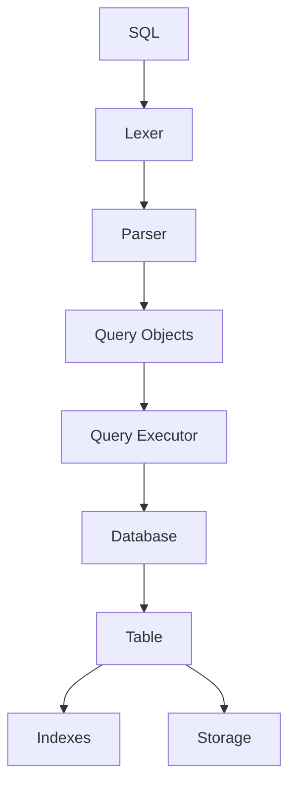
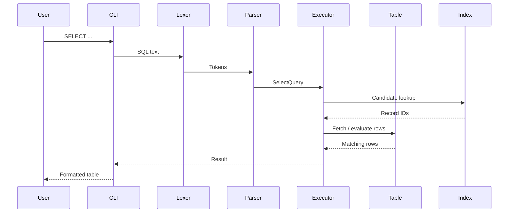

# PyDB

> **Build it to understand it.**
>
> A mini relational database engine built from scratch in **core Python** to understand what happens inside a database.

[](https://www.python.org/)
[](#project-goal)
[](#testing)

---

## 📌 Table of Contents

- [Project Goal](#project-goal)
- [Why PyDB?](#why-pydb)
- [Architecture](#architecture)
- [Features](#features)
- [Quick Start](#quick-start)
- [Interactive CLI](#interactive-cli)
- [SQL Examples](#sql-examples)
- [Indexes](#indexes)
- [Query Planning](#query-planning)
- [Transactions](#transactions)
- [Persistence](#persistence)
- [Record IDs](#record-ids)
- [Project Structure](#project-structure)
- [How a Query Works](#how-a-query-works)
- [Testing](#testing)
- [Design Decisions](#design-decisions)
- [Limitations](#limitations)
- [Future Exploration](#future-exploration)
- [Learning Outcomes](#learning-outcomes)
- [Interview Quick Reference](#interview-quick-reference)

---

## Project Goal

PyDB is **not intended to compete with PostgreSQL, MySQL, SQLite, or other production database systems**.

The goal is to remove the database abstraction and understand its internals by implementing a simplified database engine from scratch.

Instead of treating SQL as a black box, PyDB explores the pipeline underneath it:



The project focuses on answering questions such as:

- How does SQL become a structured operation?
- How are constraints enforced?
- How do indexes find rows?
- Why are B+Trees useful for range queries?
- How does a database decide between a scan and an index?
- How is state persisted?
- How can a transaction restore an earlier state?

---

## Why PyDB?

Writing SQL against an existing database teaches you **how to use a database**.

Building a small database engine teaches you **how a database works**.

For example, a normal query such as:

```sql
SELECT name
FROM users
WHERE age > 25;
```

looks simple from the outside. Inside PyDB it passes through multiple layers before rows are returned.

That layered implementation is the core learning objective of this project.

---

## Architecture

```text
                         SQL
                          │
                          ▼
                       Lexer
                          │
                          ▼
                       Parser
                          │
                          ▼
                    Query Objects
                          │
                          ▼
                   Query Executor
                          │
             ┌────────────┴────────────┐
             ▼                         ▼
          Database                  Planner
             │                         │
             ▼                         ▼
           Table              FULL SCAN / INDEX
             │
      ┌──────┼────────┐
      ▼      ▼        ▼
    Rows   Hash     B+Tree
           Index     Index
             │        │
             └────┬───┘
                  ▼
              Record IDs
                  │
                  ▼
             Query Result
```

### Layer responsibilities

| Layer | Responsibility |
|---|---|
| **Lexer** | Converts raw SQL text into tokens |
| **Parser** | Validates token order and creates Query Objects |
| **Query Objects** | Represent requested operations without executing them |
| **Query Executor** | Executes Query Objects against database state |
| **Database** | Owns tables, persistence, transactions and dirty state |
| **Table** | Owns schema, rows, constraints, Record IDs and indexes |
| **Indexes** | Provide faster candidate lookup |
| **Storage** | Persists database state |
| **CLI** | Provides an interactive user interface |

---

## Features

<details>
<summary><strong>SQL Engine</strong></summary>

Supported commands:

```text
CREATE TABLE
DROP TABLE
INSERT
SELECT
UPDATE
DELETE
CREATE INDEX
DROP INDEX
BEGIN
COMMIT
ROLLBACK
```

</details>

<details>
<summary><strong>Data Types</strong></summary>

```text
INT
TEXT
FLOAT
BOOL
NULL
```

Boolean literals:

```sql
TRUE
FALSE
```

</details>

<details>
<summary><strong>Constraints</strong></summary>

```text
PRIMARY KEY
NOT NULL
UNIQUE
DEFAULT
```

Example:

```sql
CREATE TABLE users (
    id INT PRIMARY KEY,
    name TEXT NOT NULL,
    age INT,
    city TEXT DEFAULT 'Delhi',
    salary FLOAT,
    active BOOL DEFAULT TRUE
);
```

</details>

<details>
<summary><strong>Filtering</strong></summary>

Supported operators and conditions:

```text
=
!=
<
>
<=
>=
AND
OR
BETWEEN
LIKE
IN
```

Examples:

```sql
SELECT *
FROM users
WHERE age > 25;
```

```sql
SELECT *
FROM users
WHERE age BETWEEN 20 AND 30;
```

```sql
SELECT *
FROM users
WHERE city IN ('Delhi', 'Mumbai');
```

```sql
SELECT *
FROM users
WHERE name LIKE 'A%';
```

</details>

<details>
<summary><strong>Ordering, Limiting and Aliases</strong></summary>

```sql
SELECT name, salary
FROM users
ORDER BY salary DESC
LIMIT 5;
```

Supported:

```text
ORDER BY
ASC
DESC
LIMIT
AS
```

Alias example:

```sql
SELECT
    name AS employee_name,
    salary AS income
FROM users
ORDER BY income DESC;
```

</details>

<details>
<summary><strong>Aggregations and Grouping</strong></summary>

Supported aggregates:

```text
COUNT
SUM
AVG
MIN
MAX
```

Example:

```sql
SELECT
    COUNT(*) AS total_users,
    AVG(age) AS average_age,
    MAX(salary) AS highest_salary
FROM users;
```

Grouping example:

```sql
SELECT city, COUNT(*) AS total
FROM users
GROUP BY city
HAVING COUNT(*) > 1;
```

</details>

<details>
<summary><strong>NULL Handling</strong></summary>

Internally:

```text
SQL NULL → Python None
```

NULL is handled explicitly during:

- comparisons
- aggregation
- ordering
- INSERT
- UPDATE
- persistence
- index maintenance

For example:

```text
COUNT(column) → ignores NULL
COUNT(*)      → counts the row
```

</details>

---

## Quick Start

### 1. Enter the repository

```bash
cd PyDB
```

### 2. Create a virtual environment

```bash
python3 -m venv env
```

### 3. Activate it

```bash
source env/bin/activate
```

### 4. Run the test suite

```bash
python3 -m pytest -q
```

### 5. Start the CLI

```bash
python3 -m pydb.cli
```

You should see:

```text
pydb>
```

> **Tip:** Running `python3 -m pytest` from the project root ensures Python resolves the local `pydb` package correctly.

---

## Interactive CLI

PyDB includes an interactive command-line interface with SQL execution, multiline input and diagnostic commands.

### SQL commands

```text
CREATE TABLE
INSERT
SELECT
UPDATE
DELETE
CREATE INDEX
DROP INDEX
BEGIN
COMMIT
ROLLBACK
```

### CLI meta-commands

```text
.help
.tables
.schema users
.indexes users
.explain SELECT ...
.stats SELECT ...
.exit
.quit
```

### Multiline SQL

```text
pydb> CREATE TABLE users (
...> id INT PRIMARY KEY,
...> name TEXT NOT NULL,
...> age INT,
...> city TEXT DEFAULT 'Delhi'
...> );
Table 'users' created.
```

The CLI also provides write feedback such as:

```text
1 row inserted.
2 rows updated.
1 row deleted.
Transaction started.
Transaction committed.
Transaction rolled back.
```

---

## SQL Examples

### Create a table

```sql
CREATE TABLE users (
    id INT PRIMARY KEY,
    name TEXT NOT NULL,
    age INT,
    city TEXT DEFAULT 'Delhi',
    salary FLOAT,
    active BOOL DEFAULT TRUE
);
```

### Insert rows

```sql
INSERT INTO users
VALUES (1, 'Aditya', 22, 'Delhi', 75000.50, TRUE);
```

### Column-list INSERT

```sql
INSERT INTO users (id, name, age)
VALUES (2, 'Rahul', 25);
```

Omitted columns are resolved using their defaults or NULLability rules.

### Query

```sql
SELECT name, age
FROM users
WHERE age >= 25
ORDER BY age DESC
LIMIT 5;
```

### Update

```sql
UPDATE users
SET salary = 90000
WHERE id = 1;
```

### Delete

```sql
DELETE FROM users
WHERE age > 60;
```

---

## Indexes

PyDB contains two different index implementations to demonstrate different access patterns.

### Hash Index

The hash index conceptually maps:

```text
indexed value → set of Record IDs
```

Example:

```text
22 → {1, 4, 8}
25 → {2, 7}
30 → {3}
```

This is naturally suited to equality lookups.

Create one:

```sql
CREATE INDEX age_idx
ON users(age);
```

### B+Tree Index

The B+Tree implementation includes:

- ordered keys
- leaf nodes
- linked leaves
- insertion
- node splitting
- range search
- duplicate-key support
- tree invariant checks

Create one:

```sql
CREATE INDEX salary_idx
ON users(salary)
USING BTREE;
```

Range query:

```sql
SELECT *
FROM users
WHERE salary > 70000;
```

### Index lifecycle

Indexes are maintained when rows are:

```text
INSERTed
UPDATEd
DELETEd
```

For an indexed UPDATE such as:

```sql
UPDATE users
SET age = 30
WHERE id = 7;
```

the index changes conceptually from:

```text
25 → {7}
```

to:

```text
30 → {7}
```

### Inspect indexes

```text
.indexes users
```

---

## Query Planning

PyDB includes a lightweight rule-based query-planning layer.

For supported predicates, the planner can choose between:

```text
FULL_SCAN
HASH INDEX
B+TREE INDEX
```

Example:

```text
.explain SELECT * FROM users WHERE age = 25;
```

Execution statistics:

```text
.stats SELECT * FROM users WHERE age = 25;
```

Useful statistics include:

```text
access_path
table_rows
table_rows_visited
index_candidates
condition_evaluations
rows_matched
```

### Important implementation detail

The current implementation preserves table-order behavior for result processing. Therefore, an indexed query can still visit table rows while reducing the number of condition evaluations through candidate filtering.

The statistics are primarily an **observability and learning tool**, not a claim of production-grade physical execution optimization.

---

## Transactions

PyDB supports basic transactions using snapshots.

```sql
BEGIN;
```

Make a change:

```sql
UPDATE users
SET salary = 999999
WHERE id = 1;
```

Undo it:

```sql
ROLLBACK;
```

Or make it durable:

```sql
COMMIT;
```

Conceptually:

```text
BEGIN
  │
  ▼
snapshot
  │
  ▼
changes
  │
  ├──────────────► COMMIT ──► persist
  │
  └──────────────► ROLLBACK ─► restore snapshot
```

The snapshot-based transaction mechanism covers changes involving:

- rows
- tables
- indexes
- Record IDs
- dirty-state information

### Transaction limitation

This is not a full production ACID implementation. It does not provide MVCC, sophisticated locking, crash recovery or advanced concurrent isolation.

---

## Persistence

PyDB persists database state to a JSON file.

Example:

```text
pydb.json
```

The stored state includes information such as:

- tables
- schema
- rows
- constraints
- Record IDs
- index metadata
- index-related state

On startup, the storage layer reconstructs the database from the persisted representation.

### Why JSON?

JSON was chosen because the project's goal is to understand database behavior rather than immediately build a production page-oriented storage engine.

The format is:

- easy to inspect
- easy to serialize
- easy to restore
- sufficient for a learning implementation

---

## Record IDs

Every row receives an internal Record ID.

Example:

```text
Record ID 1 → Aditya
Record ID 2 → Rahul
Record ID 3 → Priya
```

Record IDs are separate from SQL columns and are not exposed as normal SELECT fields.

### Properties

- persisted across reloads
- deleted IDs are not reused
- indexes reference Record IDs
- primary keys remain user-defined schema concepts

This creates a useful separation between **logical identity defined by SQL** and **internal storage identity used by the engine**.

---

## Project Structure

```text
PyDB/
│
├── pydb/
│   ├── __init__.py
│   ├── lexer.py
│   ├── parser.py
│   ├── query.py
│   ├── condition.py
│   ├── column.py
│   ├── table.py
│   ├── database.py
│   ├── executor.py
│   ├── storage.py
│   ├── index.py
│   ├── btree.py
│   ├── bplus_tree.py
│   ├── bplus_index.py
│   └── cli.py
│
├── tests/
│   ├── test_lexer.py
│   ├── test_parser.py
│   ├── test_query.py
│   ├── test_condition.py
│   ├── test_column.py
│   ├── test_table.py
│   ├── test_database.py
│   ├── test_executor.py
│   ├── test_index.py
│   ├── test_btree.py
│   ├── test_bplus_tree.py
│   ├── test_bplus_index.py
│   ├── test_table_index.py
│   ├── test_indexed_select.py
│   ├── test_execution_stats.py
│   ├── test_transactions.py
│   ├── test_persistence.py
│   ├── test_indexes_sql.py
│   └── ...
│
├── pydb.json
└── README.md
```

### Key files at a glance

| File | Purpose |
|---|---|
| `lexer.py` | Tokenizes SQL |
| `parser.py` | Converts tokens into Query Objects |
| `query.py` | Defines query representations |
| `condition.py` | WHERE / HAVING condition logic |
| `column.py` | Column metadata and constraints |
| `table.py` | Rows, schema, constraints, IDs and indexes |
| `database.py` | Database lifecycle, persistence and transactions |
| `executor.py` | Executes Query Objects |
| `storage.py` | JSON persistence |
| `index.py` | Hash index |
| `btree.py` | B-Tree implementation |
| `bplus_tree.py` | B+Tree implementation |
| `bplus_index.py` | Table-facing B+Tree index wrapper |
| `cli.py` | Interactive shell |

---

## How a Query Works

Consider:

```sql
SELECT name
FROM users
WHERE age > 25;
```

### Step 1 — Lexer

The lexer identifies tokens such as:

```text
SELECT
name
FROM
users
WHERE
age
>
25
```

### Step 2 — Parser

The parser validates the syntax and creates a structured query representation such as:

```text
SelectQuery(
    table_name="users",
    ...
)
```

### Step 3 — Executor

The `QueryExecutor` receives the Query Object and resolves the target table.

### Step 4 — Planning

The planner determines whether the WHERE predicate can use an available index.

### Step 5 — Candidate lookup

For an indexed predicate, the corresponding index returns candidate Record IDs.

### Step 6 — Condition evaluation

The executor evaluates the condition against candidate rows.

### Step 7 — Projection

Only the requested columns are returned.

### Step 8 — CLI output

The CLI formats the result for the user.



---

## Testing

The test suite covers the database at multiple levels.

### Component-level coverage

```text
Lexer
Parser
Query Objects
Conditions
Columns
Tables
Database
Executor
Storage
Hash Index
B-Tree
B+Tree
```

### Feature-level coverage

```text
CRUD
Constraints
NULL behavior
Aggregations
GROUP BY / HAVING
Aliases
ORDER BY / LIMIT
Record IDs
Index synchronization
Indexed SELECTs
Query planning
Execution statistics
Persistence
Transactions
CLI
SQL-level index management
```

Run the full suite:

```bash
python3 -m pytest -q
```

The project previously reached **616 passing tests** before the latest boolean-literal parser refinement. Re-run the suite after changes and use the latest terminal result as the authoritative count.

### Testing principle

The project uses isolated temporary database files for tests that exercise persistence so one test does not contaminate another test's database state.

For example:

```python
db = Database(
    file_path=str(tmp_path / "db.json")
)
```

---

## Design Decisions

<details>
<summary><strong>Why a lexer instead of string splitting?</strong></summary>

String splitting becomes fragile when SQL contains quoted strings, operators, parentheses, keywords and optional clauses. A token stream gives the parser a cleaner input representation.

</details>

<details>
<summary><strong>Why separate parsing from execution?</strong></summary>

It keeps SQL syntax concerns separate from database behavior. The parser creates a Query Object, while the executor decides how to perform that operation.

</details>

<details>
<summary><strong>Why Query Objects?</strong></summary>

They provide a structured intermediate representation. This makes parser tests independent from execution tests and makes new SQL operations easier to add.

</details>

<details>
<summary><strong>Why both hash and B+Tree indexes?</strong></summary>

Hash indexes are naturally suited to equality lookup, while B+Trees maintain order and support range-oriented access.

</details>

<details>
<summary><strong>Why separate Record IDs from primary keys?</strong></summary>

A primary key is part of the user-defined SQL schema. A Record ID is an internal storage identity. Keeping them separate avoids coupling indexes to the schema's chosen primary key.

</details>

<details>
<summary><strong>Why JSON persistence?</strong></summary>

JSON keeps persistence transparent and easy to inspect while allowing the project to focus on database mechanics rather than production storage engineering.

</details>

<details>
<summary><strong>Why snapshot-based transactions?</strong></summary>

A snapshot is straightforward to reason about and demonstrates rollback semantics without requiring WAL, MVCC or a full recovery subsystem.

</details>

---

## Limitations

PyDB is intentionally simplified.

It currently does **not** aim to provide:

```text
Production-scale storage
Full SQL grammar
A full join engine
A cost-based optimizer
MVCC
Advanced locking
Write-ahead logging
Crash recovery
Complete B+Tree physical deletion
Page-based storage
Buffer pool management
Concurrent transaction isolation
```

These are not accidental omissions; they represent areas that can be explored later as the learning scope expands.

---

## Future Exploration

Potential next steps include:

- Full B+Tree deletion with merge / redistribution
- JOIN support
- Composite indexes
- Better query optimization
- Cost-based planning
- Page-based storage
- Buffer/cache management
- Write-ahead logging
- Crash recovery
- More complete transaction isolation
- Concurrency control
- More advanced SQL grammar

A natural progression is:

```text
Current PyDB
    ↓
Better SQL
    ↓
Joins
    ↓
Better Planner
    ↓
Page Storage
    ↓
Buffer Pool
    ↓
WAL + Recovery
    ↓
Concurrency / Isolation
```

---

## Learning Outcomes

Building PyDB provides hands-on understanding of:

```text
SQL parsing
Query representation
Query execution
Table storage
Constraints
NULL semantics
Record identity
Hash indexing
B-Tree structures
B+Tree structures
Range searching
Query planning
Execution statistics
Persistence
Transactions
CLI design
Testing and state isolation
```

The biggest takeaway is that a database is not simply a collection of tables.

It is a **pipeline of cooperating components** that transform a high-level query into controlled operations over stored data.

---

## Interview Quick Reference

<details>
<summary><strong>30-second project answer</strong></summary>

> PyDB is a mini relational database engine I built from scratch in core Python to understand database internals. It implements a SQL lexer, parser, query objects, executor, table and constraint management, hash and B+Tree indexes, lightweight query planning, execution statistics, JSON persistence, transactions and an interactive CLI. The project is intentionally educational rather than production-oriented.

</details>

<details>
<summary><strong>Explain the architecture</strong></summary>

> SQL is first tokenized by the lexer, then parsed into a Query Object. The QueryExecutor executes that structured request against the Database and Table layers. Tables manage schema, rows, constraints and stable Record IDs. Indexes provide candidate Record IDs, while the storage layer persists database state. The CLI exposes the system interactively.

</details>

<details>
<summary><strong>Why hash index + B+Tree?</strong></summary>

> A hash index is naturally good for equality lookup because it maps a value directly to Record IDs. A B+Tree maintains sorted keys, which makes range queries much more natural. Implementing both let me understand the trade-off between unordered equality-oriented access and ordered range-oriented access.

</details>

<details>
<summary><strong>How does UPDATE affect an index?</strong></summary>

> If an indexed value changes, the old Record ID is removed from the old index entry and inserted into the new value's entry. That keeps the index synchronized with the row data.

</details>

<details>
<summary><strong>How do transactions work?</strong></summary>

> BEGIN captures a database snapshot. Changes are applied normally. COMMIT persists the current state and clears the snapshot, while ROLLBACK reconstructs the tables from the snapshot. It demonstrates basic rollback semantics but is not a full production ACID implementation.

</details>

<details>
<summary><strong>What would you improve for production?</strong></summary>

> I would move from JSON to page-based storage, add a buffer pool, WAL and crash recovery, improve query optimization with cost estimation, implement joins and composite indexes, add proper concurrency control and stronger transaction isolation, and complete B+Tree deletion.

</details>

---

## Philosophy

> ### Build it to understand it.

PyDB is a hands-on exploration of how a relational database works internally.

The project is valuable not because it replaces a production database, but because every layer exposes a concept that is normally hidden behind SQL.

---
